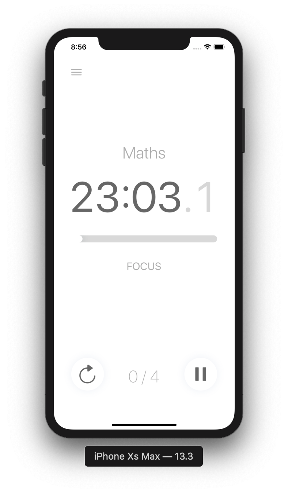
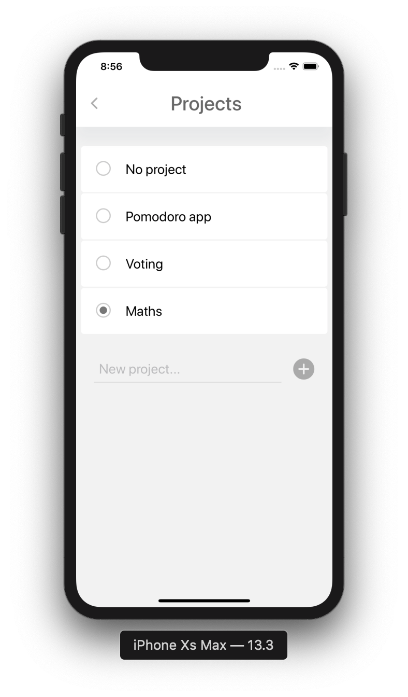
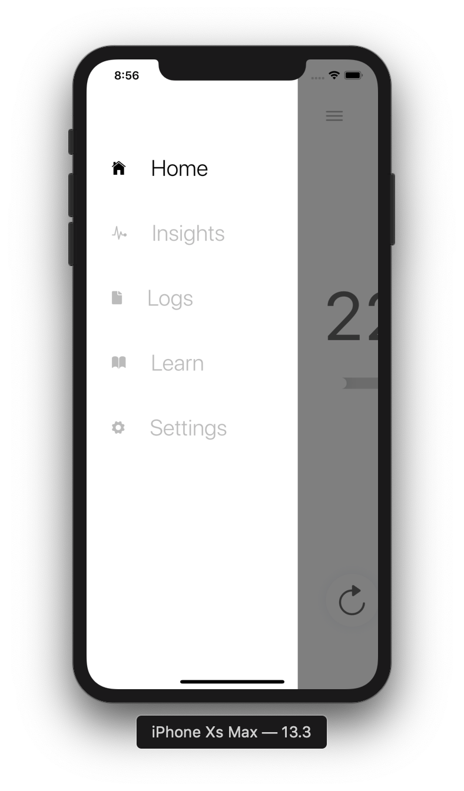
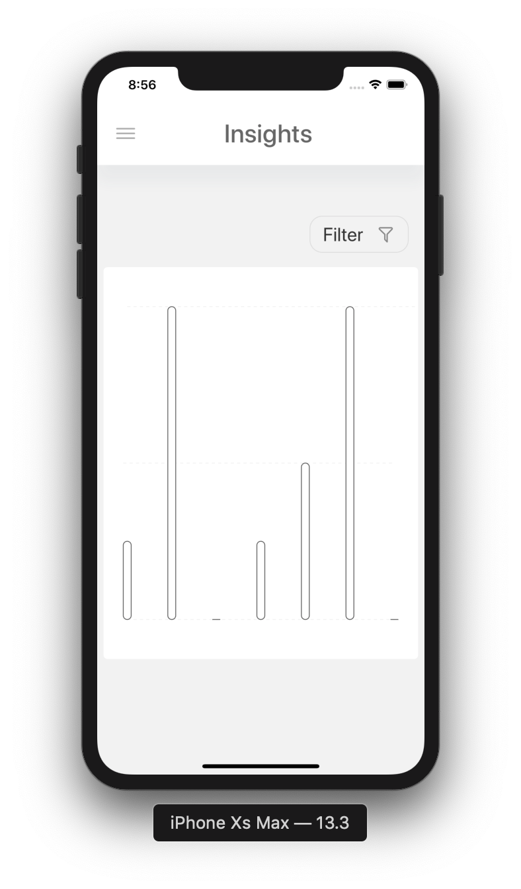
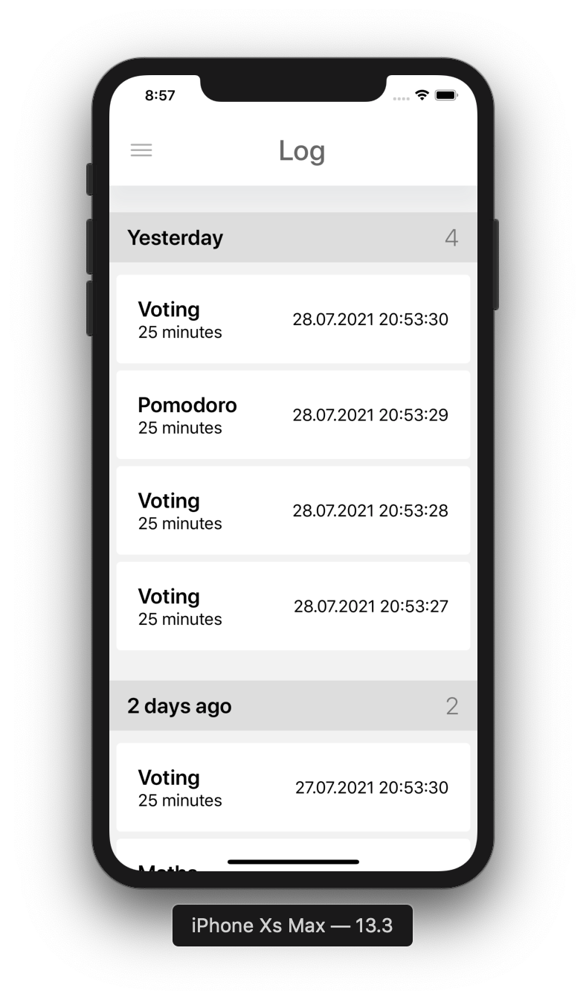
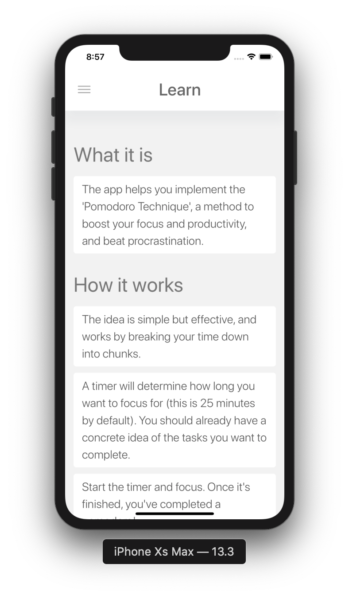
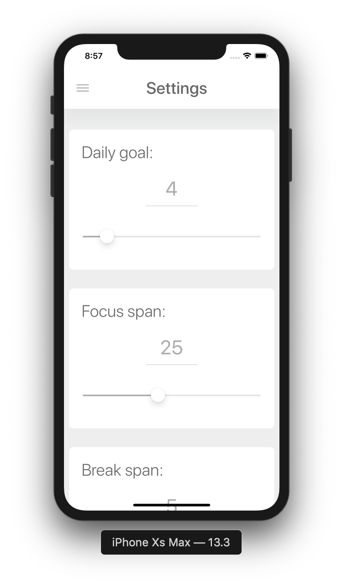

# Pomodoro Mobile

This is a project I used to learn about developing for mobile using React Native. It is a pomodoro productivity timer you can use to track your work sessions.

## Tech used
- React Native
- Expo
- React Native SVG and D3 scale to construct graphs
- React Navigation for navigation

## Demo
```
// run the android simulator
npm android
// run the ios simulator
npm ios
```

## Screenshots






